# Extract Data

This extension allows to extract data on opened tabs and copy it to clipboard. (as JSON, XLS or with textual format)

By right clicking on an element and defining an extraction rule, each time you will visit the site again, the data will be automatically extracted and available for a copy to the clipboard.

## Compatibility

* Mozilla Firefox
* Google Chrome
* Microsoft Edge

## How to use it

On a interesting element on a page, just `Right-Click > Create a new rule`

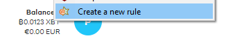

**That's all.** If you look at the toolbar, the element is available by clicking on the addon icon.

:thumbsup: If you visit again the site, it will be directly available here again.

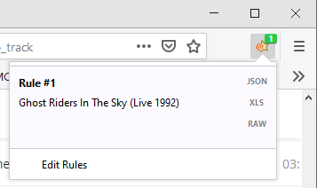

You can add additional element: 

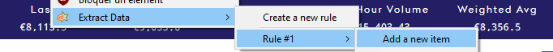

It will be added to the toolbar: 

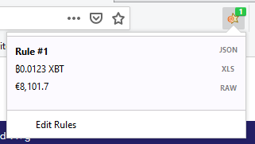

:thumbsup: If the value within the site change, the value will be dynamically changed here too

## Fine settings

You can Edit created rules.

Just click on `Edit rules` in the toolbar or in the contextual menu. It opens a new dialog allowing finer tune.

### From:

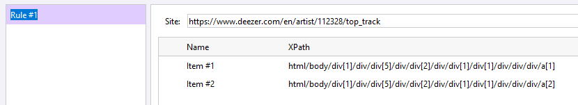

### To:

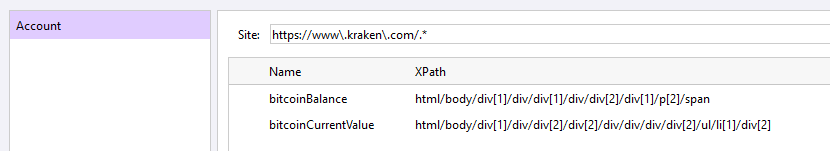

You can do basic stuff:
- Edit rule and item names (F2 or Double Click)
- Delete rules and items (Delete key)

You can do better stuff:
- Use a **Regular expression for Site**
- Edit XPath (even if contextual menu `Change Item #XX` allows easier change)
- Validate if your rules are working properly (see dedicated section)

## Clipboard

When you click on the dedicated button, it will copy the result to the clipboard.

### JSON format

If you click on JSON button

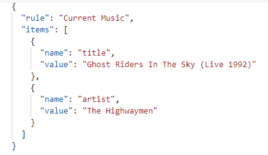

### XLS format

If you click on XLS button, you can paste it to Excel with this format

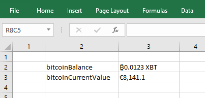

### RAW/Textual format

If you click on RAW button

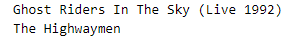

## Validate rules

### Highlight elements

Anywhere on a page, just `Right-click > Highlight` to identify which elements are already marked by a given rule.

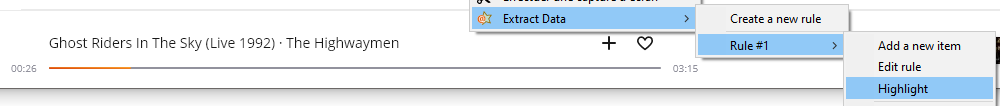

### Contextual indicators (Firefox only)

On a page, invalid items are displaying a warning aside.

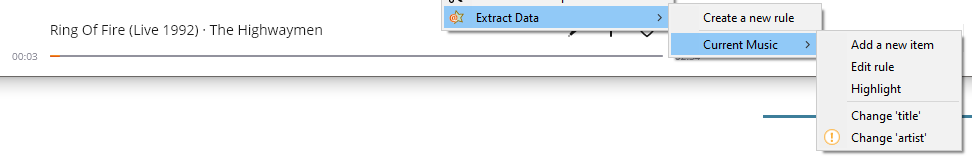

### Validation indicators

Especially when a rule is covered by a `Regular Expression`, selected items may not work on some matched pages.

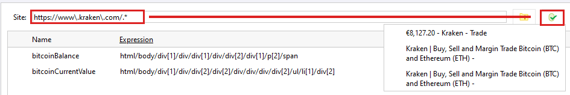

The `Green button` will list all opened tabs that are matched by the Site field.

By clicking on one of them, it will highlight elements on the page and indicates which items are not matched.

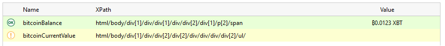
